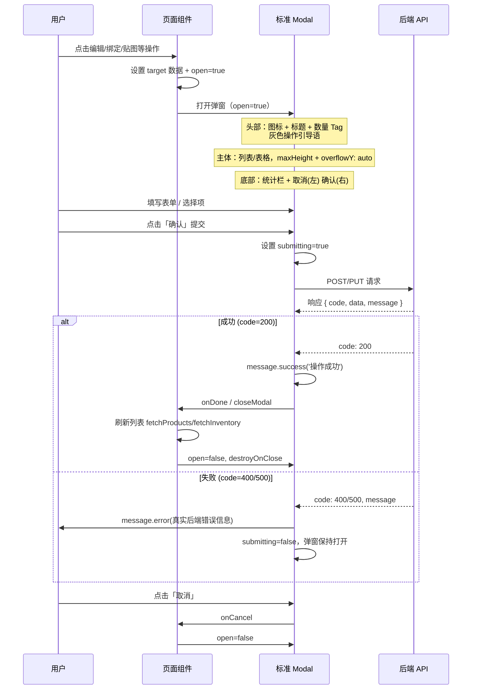

# EMAG 跨境电商管理系统 - 架构文档

> 本文档描述系统整体架构。开发新功能前请先阅读，确保不破坏现有流水线。

---

## 1. 后端架构（概要）

- **技术栈**: Node.js + Express + TypeScript，数据库 PostgreSQL + Prisma ORM
- **端口**: 3001
- **核心铁律**: 单一数据管线（Normalizer）、两段式深度抓取、黄金图片提纯、禁止硬编码特判
- **统一响应格式**: `{ code: 200/400/500, data: [.../object/null], message: string }`

---

## 2. 前端架构 (Frontend Architecture)

### 2.1 前端目录结构树 (Frontend Directory Tree)

```
frontend/
├── src/
│   ├── pages/           # 页面级组件，按业务模块划分
│   │   ├── Login.tsx           # 登录页（独立路由 /login）
│   │   ├── Dashboard.tsx      # 主工作台（含多业务入口）
│   │   ├── PlatformProducts.tsx   # 平台产品（已上架店铺产品）
│   │   ├── PlatformOrders.tsx     # 平台订单
│   │   ├── PublicPool.tsx        # 公海产品池
│   │   ├── PrivatePool.tsx       # 私海产品池
│   │   ├── InventorySKU.tsx     # 库存 SKU 管理
│   │   ├── SupplyChain.tsx      # 供应链
│   │   ├── ProcurementPlanning.tsx
│   │   ├── ProcurementManagement.tsx
│   │   ├── ShopAuth.tsx         # 店铺授权
│   │   ├── AlibabaSettings.tsx  # 1688 映射配置
│   │   └── UserManagement.tsx  # 用户与权限管理
│   │
│   ├── components/      # 可复用 UI 组件
│   │   ├── ProductImage.tsx    # 全局产品图片（fallback/onError 容错）
│   │   ├── AlibabaMappingModal.tsx  # 1688 映射弹窗（标准 Modal 结构）
│   │   └── SyncStatusBar.tsx   # 同步状态栏
│   │
│   ├── lib/             # 工具与请求封装
│   │   ├── request.ts   # Axios 实例，JWT 注入、401 跳转
│   │   └── currency.ts  # 货币格式化（100% 依赖后端 currency 字段）
│   │
│   ├── assets/          # 静态资源（图片、字体等）
│   ├── App.tsx          # 根组件，路由配置
│   └── main.tsx         # 入口
│
├── public/              # 静态公共资源
├── vite.config.ts      # Vite 配置，端口 5173，/api 代理至 3001
└── package.json
```

**目录职责简述**：

| 目录 | 作用 |
|------|------|
| `src/pages` | 业务页面，每个文件对应一个功能模块，负责数据拉取与状态管理 |
| `src/components` | 跨页面复用的 UI 组件，如 `ProductImage`、各类 Modal |
| `src/lib` | 请求封装（`request`）、货币/价格格式化（`currency`）等纯逻辑工具 |
| `src/assets` | 图片、字体等静态资源 |

---

### 2.2 前端核心渲染机制说明

遵循 `.cursorrules` 中的 **哑巴渲染与优雅兜底** 原则：

#### 2.2.1 平台产品页面的图片容错处理机制（fallback）

- **组件**: `ProductImage`（`src/components/ProductImage.tsx`）
- **数据来源**: 100% 依赖后端返回的 `record.main_image`，无地区或店铺特判
- **容错策略**:
  1. **空值**: 若 `url` 为空、`null` 或 `undefined`，直接渲染 `EMAGPlaceholder` 占位图，不发起任何网络请求
  2. **加载失败**: 使用 Ant Design `Image` 组件的 `fallback` 属性，传入 `EMAGPlaceholder`；同时通过 `onError` 回调将 `loadError` 置为 `true`，后续渲染统一走占位图
  3. **悬浮预览**: `Popover` 内的预览图同样具备 `onError` 兜底，失败时展示占位图
- **禁止行为**: 严禁出现浏览器原生碎图图标；所有异常路径均展示统一的 eMAG 风格占位图

#### 2.2.2 货币与价格的显示逻辑

- **原则**: 前端禁止自行拼接货币符号或跳转链接，**100% 依赖后端返回字段**
- **实现**:
  - 货币代码（如 `EUR`、`RON`、`HUF`）由后端在列表接口中返回（`res.currency` 或 `list[0].currency`）
  - 价格列：使用 `r.price ?? r.sale_price ?? r.salePrice` 取数值，`r.currency` 取币种；展示格式为 `{num} {suffix}`（如 `99.99 RON`）
  - 预估毛利列：同样使用 `r.currency` 作为后缀，盈亏使用红绿警示色（`#52c41a` / `#ff4d4f`）
- **工具函数**: `src/lib/currency.ts` 中的 `formatCurrencySuffix`、`formatPrice` 仅做展示格式化，不参与业务逻辑或地区判断

---

### 2.3 全局标准弹窗交互图 (Working Modal Lifecycle)

根据 `.cursorrules` 中的 **全局弹窗设计规范**，标准弹窗从触发到关闭的完整生命周期如下：



**生命周期要点**：

1. **触发**: 用户点击操作按钮 → 页面设置 `target` 与 `open=true` → Modal 渲染
2. **结构**: 头部（图标+标题+Tag+引导语）、主体（列表/表格+滚动）、底部（统计+取消+确认）
3. **提交**: 点击确认 → `submitting` 防重复 → 调用 API → 成功则 `message.success` + 关闭 + 刷新列表；失败则 `message.error` 展示后端真实错误，弹窗保持打开
4. **取消**: 点击取消 → `onCancel` → `open=false`，`destroyOnClose` 确保下次打开为干净状态

---

*文档版本：基于 .cursorrules 与现有前端代码整理。*
